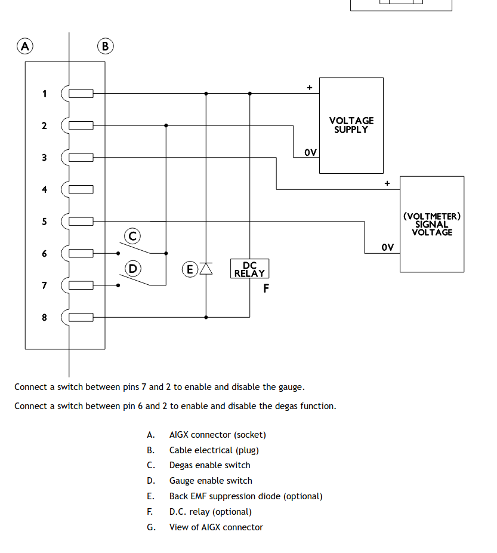

The gauge should not be operated at pressures higher than 50 mTorr
You must degas the AIGX regularly. Failure to do so will affect the performance and reduce the lifetime of the
gauge.
Degas the AIGX when the pressure is below 10 uTorr.

Connection_OK = voltage > 0 < 10
Or pin4 = HIGH

Activity
- 2 modes

Gauge on = solid
Degas on = blinking

