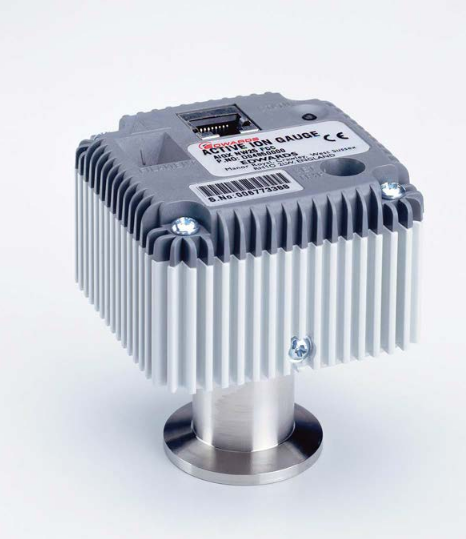
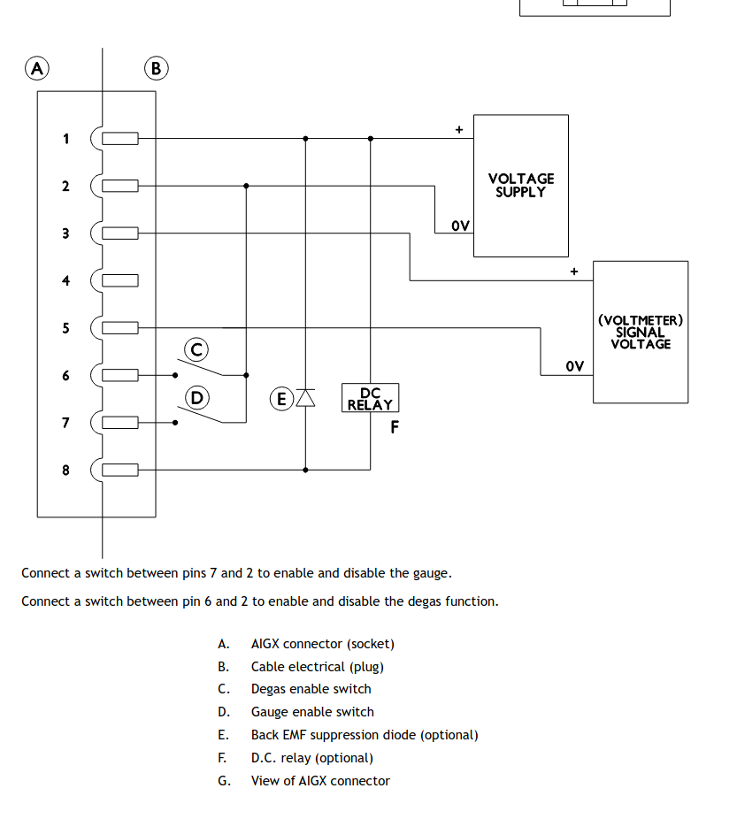
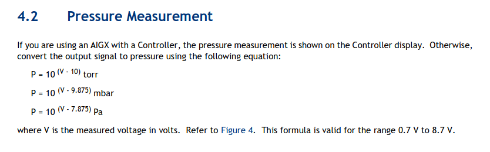

# AIGX-S-NW25

The ION gauge is used to measure extremely low pressures of the chamber, way more than the Pirani gauge can handle.

The gauge should not be operated at pressures higher than 50 mTorr.
You must degas the AIGX regularly. Failure to do so will affect the performance and reduce the lifetime of the
gauge.
Degas the AIGX when the pressure is below 10 uTorr.

The gauge will automatically switch off when the measured pressure rises above 50 mTorr.

Connection_OK = voltage > 0 < 10
Or pin4 = HIGH

Activity
- Gauge on = solid  
- Degas on = blinking

Converting voltage to pressure

Measurement range: 0.7 V to 8.7 V

#### Error Voltages
Gauge disabled: 9.0 V  
Emission error: 9.5 V  
Over-pressure trip: 9.7 V  
