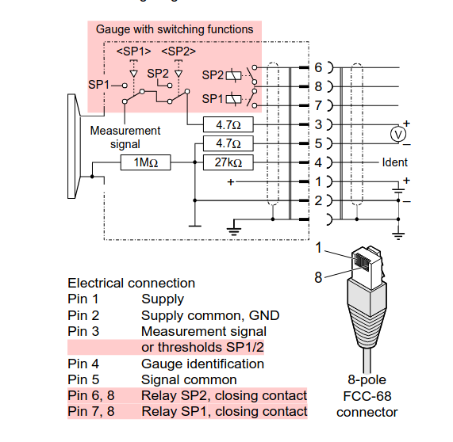

# PSG500/-S Pirani Gauge

## Wiring Diagram

## connection_ok detection

To detect if Pirani gauge is plugged in we could use identification resistor (pin 4).  
But it requires coupling supply ground (pin 2) to signal ground (pin 5).  
Since this is not recommended, we will use the measurement signal (pin 3) as an indicator.  
If voltage is within nominal range, it indicates gauge is plugged in.

## ADC scaling

Using a voltage divider to scale 10.3V to 3.3v

- R1 = 10k between A2 (pin 34 on Pi) and ground
- R2 = 22k between A2 and measurement signal of Pirani gauge

### RJ45 connector:

The pirani module has a RJ45 connector so that a standard LAN cable can be used to plug in the gauge.

| Pin | Signal      |
|-----|-------------|
| 1   | +20V supply |
| 2   | 20V ground  |
| 3   | ADC +       |
| 4   |             |
| 5   | ADC ground  |
| 6   |             |
| 7   |             |
| 8   |             |
