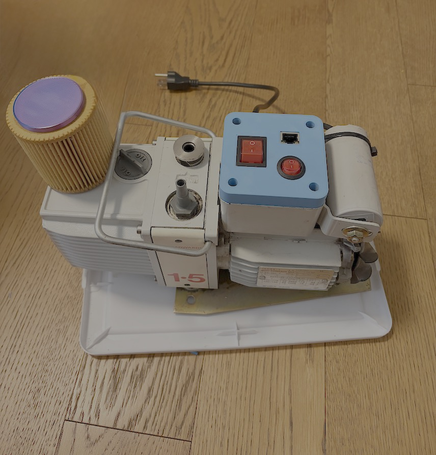

# Edwards E2M1.5 roughing pump

  
[Product Data Sheet](https://www.edwardsvacuum.com/content/dam/brands/edwards-vacuum/general-vacuum/downloads/rotary-vane-pumps/3601-0714-01-E2M0.7-2.5-datasheet.pdf)

This pump does not have any control circuitry.
It starts pumping as soon as you plug in the power.
A Solid State Relay (SSR) was installed in the top housing to allow digital control.
A safety switch, manual override switch and a RJ45 receptacle were installed on the top plate.

### RJ45 pinout

| Pin | Signal                 |
|-----|------------------------|
| 1   | GND                    |
| 2   | Green LED (pump side) |
| 3   | SSR on                 |
| 4   | GND                    |
| 5   |                        |
| 6   |                        |
| 7   |                        |
| 8   | Red LED (pump side)    |

Pin 2 and 8 are connected to the green/yellow LED pins on the module side.
