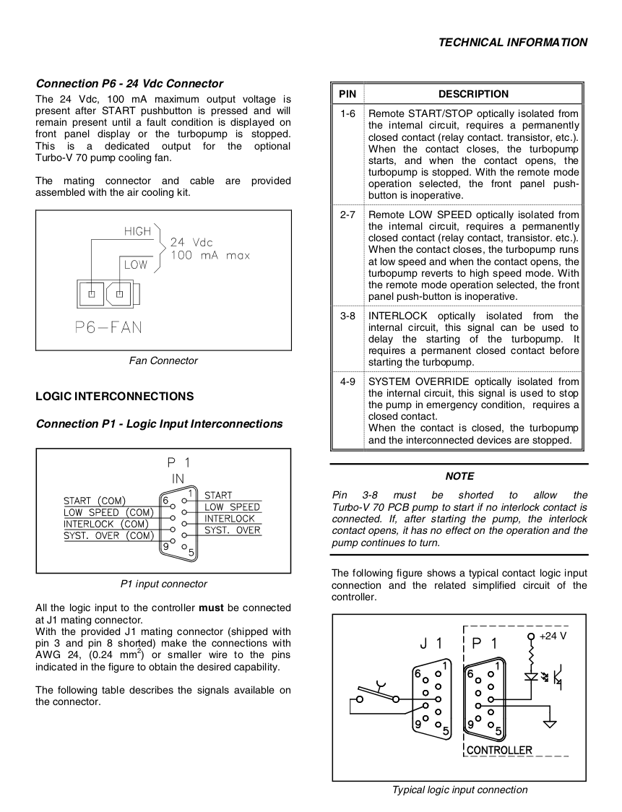
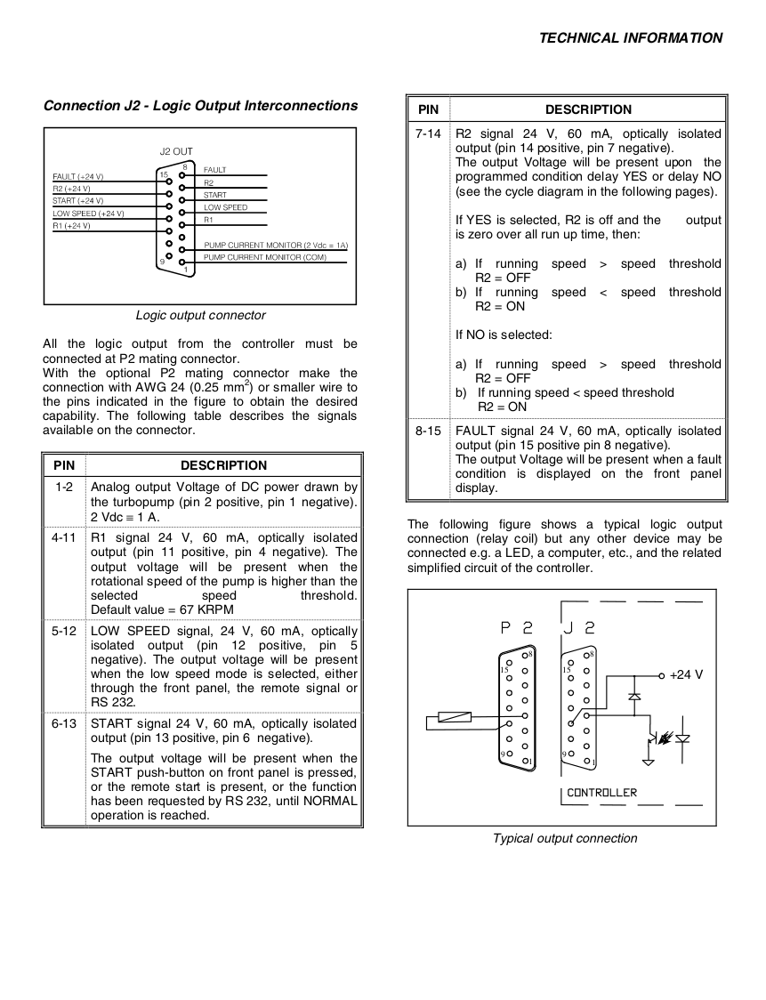

# Turbo Pump

It uses two RJ45 connectors.
One connects to P1 port and the other to J2 port.

## P1 - input commands

We are interested in Start and Low Speed commands.

Pi <-> RJ45 <-> Turbo P1

| Signal    | RJ45 | Turbo | Pi   |
|-----------|------|-------|------|
| INTERLOCK | 1    | 3     |      |
| LOW SPEED | 2    | 2     | GP21 |
| COM       | 3    | 6     |      |
| COM       | 4    | 8     |      |
| COM       | 5    | 7     |      |
| NC        | 6    | 5     |      |
| OVERRIDE  | 7    | 4     |      |
| START     | 8    | 1     | GP18 | 

* GPIO is connected via an optocoupler.

## J2 - output signals

2V = 1A

Pi <-> RJ45 <-> Turbo J2

| Signal      | RJ45 | Turbo | Pi                   |
|-------------|------|-------|----------------------|
| 24V         | 1    | 15    | Opto Gate (via 220R) |
| FAULT       | 2    | 8     | GP15                 |
| START       | 3    | 6     | GP14                 |
| LOW SPEED   | 4    | 5     | GP13                 |
| CURRENT     | 5    | 2     | GP28/ADC2            |
| CURRENT COM | 6    | 1     | AGND                 |
| R1          | 7    | 4     | TODO                 |
| R2          | 8    | 7     | TODO                 |

* GPIO is connected via an optocoupler.
R1 = rotational speed higher than 67K RPM 
R2 = rotational speed lower than 67K RPM
